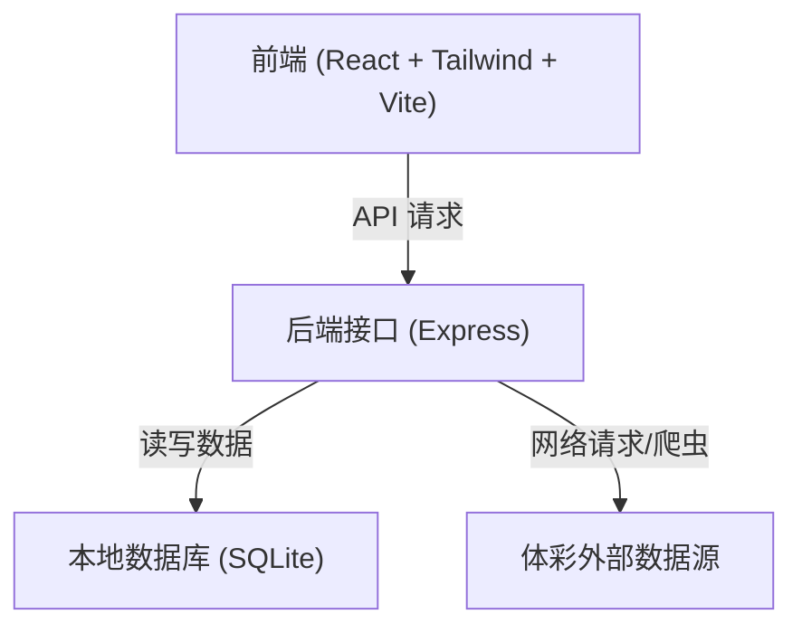
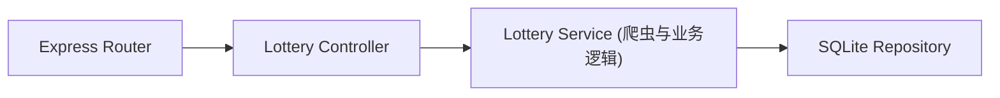
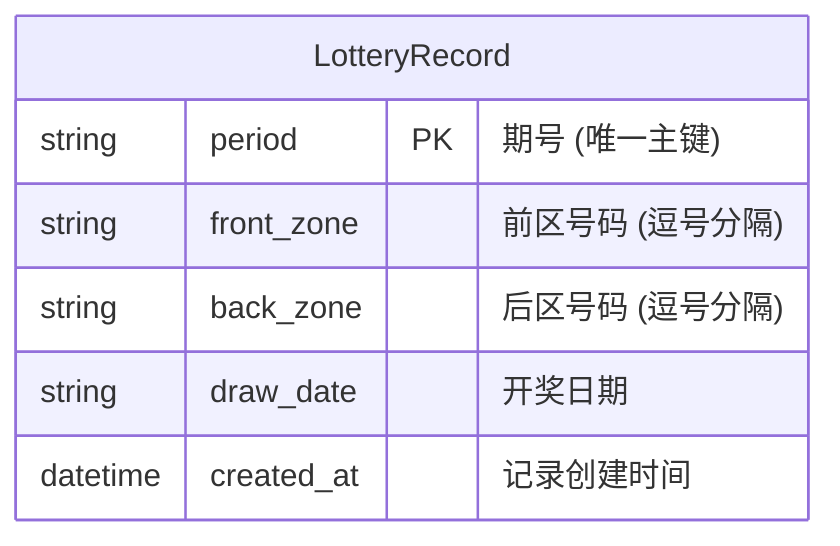

## 1. 架构设计


## 2. 技术栈说明
- **前端**: React@18 + tailwindcss@3 + vite (使用 zustand 进行状态管理)
- **后端**: Node.js + Express + sqlite3
- **初始化工具**: vite-init (使用 react-express-ts 模板)
- **爬虫机制**: 使用 axios 和 cheerio 或官方公开 API (如 `webapi.sporttery.cn`) 来抓取最新开奖数据

## 3. 路由定义 (前端)
| 路由 | 目的 |
|-------|---------|
| / | 首页概览，包含最新开奖和更新按钮 |
| /generator | 号码生成器页面 |
| /history | 历史数据与冷热走势分析页面 |

## 4. API 定义 (后端)
```typescript
// 1. 获取最新一期/多期开奖数据
// GET /api/lottery/latest?limit=10
interface LotteryRecord {
  period: string;       // 期号, e.g. "23044"
  frontZone: number[];  // 前区号码
  backZone: number[];   // 后区号码
  drawDate: string;     // 开奖日期
}

// 2. 触发同步最新数据
// POST /api/lottery/sync
interface SyncResponse {
  success: boolean;
  message: string;
  syncedCount: number;
}

// 3. 获取冷热号统计
// GET /api/lottery/stats
interface LotteryStats {
  frontHot: { number: number, count: number }[];
  backHot: { number: number, count: number }[];
}
```

## 5. 服务端架构图


## 6. 数据模型
### 6.1 数据模型定义


### 6.2 DDL 定义
```sql
CREATE TABLE IF NOT EXISTS lottery_records (
    period VARCHAR(20) PRIMARY KEY,
    front_zone VARCHAR(50) NOT NULL,
    back_zone VARCHAR(20) NOT NULL,
    draw_date VARCHAR(20) NOT NULL,
    created_at DATETIME DEFAULT CURRENT_TIMESTAMP
);

CREATE INDEX IF NOT EXISTS idx_draw_date ON lottery_records(draw_date DESC);
```
