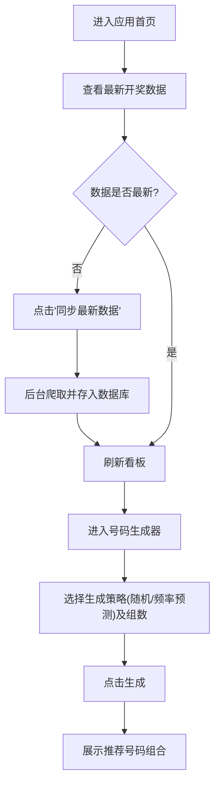

## 1. 产品概述
这是一款专为“中国体育彩票超级大乐透”设计的随机号码生成与历史数据分析 Web 应用。
- **主要目的**：帮助用户获取所有的历史开奖记录（包括目前26044期+最新期数），通过点击按钮实时爬取/更新最新一期的开奖号码，并保存在数据库中。
- **核心功能**：支持随机生成下注号码（包含完全随机、根据历史热度分析的预测号码），支持用户自定义生成组数和搭配。旨在为用户选号提供趣味性和参考，增加娱乐性。
- **目标用户**：大乐透彩民、对彩票数据分析感兴趣的用户。

## 2. 核心功能

### 2.1 功能模块
1. **首页大盘 (Dashboard)**：展示最新一期大乐透开奖结果，以及历史数据统计面板。
2. **号码生成器 (Generator)**：提供纯随机生成、基于历史概率的预测生成，支持单组或多组搭配生成。
3. **数据管理 (Data Management)**：提供一键更新功能，通过后台接口实时抓取最新的开奖数据并存入数据库。
4. **历史走势 (History)**：以列表或图表形式展示最近开奖的历史记录和冷热号统计。

### 2.2 页面详细说明
| 页面名称 | 模块名称 | 功能描述 |
|-----------|-------------|---------------------|
| 首页大盘 | 最新开奖看板 | 展示最近一期开奖号码、奖池金额等 |
| 首页大盘 | 数据更新控制 | “一键同步最新数据”按钮，调用后台更新DB |
| 号码生成 | 生成配置区 | 选择生成模式（随机/预测）、组数、必选/排除号码 |
| 号码生成 | 结果展示区 | 呈现生成的号码组合，支持复制或保存 |
| 历史走势 | 冷热号分析 | 统计历史上出现频率最高和最低的前区/后区号码 |

## 3. 核心流程
用户进入应用后，可以先点击更新数据以保证题库最新，然后前往生成器获取下注推荐。

## 4. 用户界面设计
### 4.1 设计风格
- **主色调**：深邃的藏青色或科技黑（体现数据分析的专业感），搭配大乐透经典的红色（前区）和蓝色（后区）作为点缀色。
- **按钮样式**：微质感渐变、圆角按钮，点击时带有动效。
- **字体**：现代无衬线字体，数字采用等宽字体（Monospace）以增强对齐和专业感。
- **布局**：响应式卡片布局，侧边栏或顶部导航。
- **氛围**：整体倾向于“数据驾驶舱（Data Dashboard）”的极客风格，避免枯燥，带有一定的未来感。

### 4.2 页面设计概览
| 页面名称 | 模块名称 | UI 元素 |
|-----------|-------------|-------------|
| 首页 | 概览卡片 | 包含大号发光的红蓝球UI、数据同步的加载动画 |
| 生成器 | 控制面板 | 滑块（选择组数）、拨动开关（选择模式）、脉冲发光按钮 |
| 走势图 | 统计列表 | 带有色彩浓度条的数据条目（表示频率高低） |

### 4.3 响应式设计
采用桌面端优先（Desktop-first），并完美适配移动端（手机上以单列卡片垂直堆叠为主，方便单手操作）。
